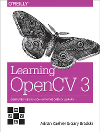

# OpenCV book

Personal notes, exercises and snippets.

## Chapter 1

## Chapter 2

- [x] Load images.

- [x] Load videos.

- [x] Load videos with scrollbar.

- [x] Read data from camera.

- [x] Saving video to a file.

**TASKS:**

- [x] Read data from camera, perform some transformations and save to a file.

## Chapter 3

**TASKS:**

- [x] Core functions in action.
- [x] Multiplying different matrices data types.

## Chapter 4

**TASKS:**

- [x] Numerical keyboard
- [x] Playing with [*summed-area table* (aka *integral image*)](https://en.wikipedia.org/wiki/Summed-area_table)

## Chapter 5

**TASKS:**

- [ ] Drawing shapes.
- [ ] Fancy Pyramid.

## Chapter 6

